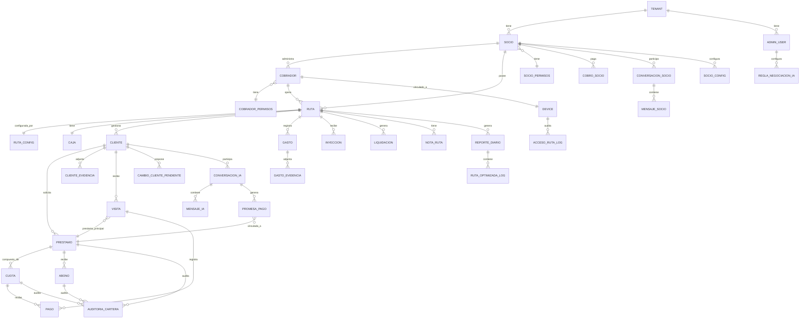

# PRD — Plataforma de Préstamos y Cobranza con Asistente de IA

**Nombre de trabajo:** CobraIA (nombre provisional)
**Basado en:** Análisis de 18 videos tutoriales del sistema Smart 369 (gestión de préstamos y cobranza para prestamistas/cobradiarios), extendido con arquitectura de funcionalidades de IA conversacional, optimización de rutas y seguridad de dispositivos.
**Versión:** 1.1
**Fecha:** Agosto 2026
**Cambios v1.1:** consolidación de requerimientos acordados en sesión de revisión (periodo de liquidación configurable, notas de ruta, historial de reportes, evidencias en gastos, método de pago en visitas, fotos del cliente, caja de ruta, múltiples préstamos y tope de deuda, auditoría de cuotas/abonos, notificaciones antes/durante/después, historial de conversaciones, tarjeta de préstamo, días de cobro, registro de visita con motivos, actualización de cliente con aprobación, fecha de préstamo editable, dos direcciones del cliente, detalle de ruta, segmentación de trayectos, lista del día con colores, navegación al cliente, cobros de socios, bloqueo automático por mora, configuración del socio, conversaciones Admin↔Socio, offline-first y métodos de pago para socios).

---

## 1. Objetivo principal de la app

Construir una plataforma SaaS multi-tenant para prestamistas y cobradiarios que digitalice el ciclo completo de préstamos y cobranza (rutas, clientes, cartera, pagos, abonos, gastos y liquidaciones), replicando las capacidades operativas validadas de Smart 369, pero añadiendo tres diferenciadores estratégicos:

1. **Un asistente de cobranza con IA operado 100% por WhatsApp**, que automatiza conversaciones de cobro, recordatorios, negociación de planes de pago dentro de límites configurados por el administrador, y que deriva a un humano cuando el caso lo requiere.
2. **Optimización inteligente de rutas de cobro**, que calcula el trayecto más corto y lo reorganiza dinámicamente según eventos en tiempo real (clientes no disponibles, pagos digitales anticipados).
3. **Un protocolo de seguridad y control de dispositivos** que vincula la identidad del cobrador (WhatsApp + IMEI) para proteger la información sensible de rutas, clientes y cartera frente a fugas o suplantación.

El resultado debe reducir la dependencia de métodos físicos/Excel, minimizar pérdidas de cartera por falta de seguimiento, y reducir el tiempo operativo del cobrador en campo, manteniendo el control administrativo centralizado que ya ofrece Smart 369 (roles, permisos granulares, reportes y liquidaciones).

---

## 2. Requerimientos funcionales (Historias de usuario)

Las historias se agrupan en 10 épicas. Las primeras 5 épicas están fundamentadas directamente en las funcionalidades observadas en los videos de Smart 369; las épicas 6 a 8 corresponden a la arquitectura de funcionalidades esperada (diferenciadores del producto); las épicas 9 y 10 cubren el cobro a socios y el modo offline de la APK.

### Épica 1 — Gestión de identidad, roles y jerarquía (Admin → Socio → Cobrador)

Basado en: registro/edición de socios, registro/edición de cobradores, bloqueo/activación, configuración de permisos de socio.

- **HU-01.** Como Administrador, quiero iniciar sesión con usuario y contraseña sobre un canal cifrado (HTTPS/TLS), para acceder de forma segura al panel administrativo.
- **HU-02.** Como Administrador, quiero registrar un Socio con usuario, contraseña, nombre, apellido, correo, teléfono, código, tipo de moneda y estatus, para habilitar la operación de una nueva cartera/negocio.
- **HU-03.** Como Administrador, quiero registrar un Cobrador asociado obligatoriamente a un Socio existente, para mantener la jerarquía Socio → Cobrador → Ruta.
- **HU-04.** Como Administrador, quiero editar los datos de un Socio o Cobrador (nombre, apellido, contraseña) sin poder visualizar la contraseña anterior, para permitir recuperación de acceso sin comprometer la confidencialidad de la credencial.
- **HU-05.** Como Administrador, quiero bloquear o activar a un Socio (bloqueando su acceso a la plataforma y, en cascada, el acceso de sus Cobradores y sus rutas asignadas) y a un Cobrador (bloqueando en cascada todas sus rutas asignadas), para suspender operaciones ante mora, incumplimiento o desvinculación. El bloqueo debe ser efectivo de inmediato: el estado se revalida en cada petición autenticada.
- **HU-06.** Como Administrador, quiero configurar una matriz de permisos por Socio (ej. eliminar rutas, eliminar préstamos, eliminar abonos/gastos/inyecciones, generar/ver/descargar reportes, bloquear cobradores, modificar cupos, registrar socios/cobradores/rutas, editar permisos), para delegar responsabilidades sin ceder control total de la plataforma.
- **HU-07.** Como Socio, quiero acceder únicamente a las funciones habilitadas por mis permisos, para operar dentro de los límites definidos por el Administrador.
- **HU-61.** Como sistema, quiero bloquear automáticamente a un Socio cuando su retraso de pago supere los días de tolerancia configurados (parametrizados por socio) tras su fecha de cobro, y habilitarlo automáticamente al registrarse el pago de su cobro, para asegurar el cumplimiento de la obligación de pago sin intervención manual.
- **HU-62.** Como Administrador o Socio con permiso, quiero configurar los datos del Socio (nombre de la oficina de cobro, usado como remitente en las notificaciones de WhatsApp al cliente, y otros campos de configuración), para personalizar la operación de su cartera.

### Épica 2 — Gestión de rutas y configuración operativa

Basado en: registro/edición de rutas, configuración de permisos de ruta (APK), inyecciones de capital.

- **HU-08.** Como Socio o Administrador, quiero registrar una Ruta con nombre, descripción, socio, cobrador, tipo de interés (%), número de cuotas, moneda y país, definiendo además el saldo inicial de su caja (obligatorio) y el costo base de cobro al socio, para habilitar un nuevo circuito de cobro.
- **HU-09.** Como Administrador, quiero editar el nombre de una ruta existente, para corregir o actualizar su identificación sin alterar su configuración operativa.
- **HU-10.** Como Administrador o Socio con permiso, quiero configurar una matriz de parámetros por ruta (cuotas mínimas de préstamo, umbral de cuotas en atraso, manejo de cupo y cupo por defecto, bloqueo de cambio de interés, comisión %, visibilidad de caja/cartera/préstamos, reconocimiento facial, permisos de eliminación de préstamos/pagos/gastos/abonos/inyecciones, bloqueo automático de clientes morosos, restricción de cambio de fecha de préstamo, borrado de clientes sin deuda, periodo de liquidación, días no laborables, métodos de pago permitidos, registro de documento del cliente, días de anticipación de notificaciones), para controlar de forma granular lo que el cobrador puede hacer desde la app móvil en campo.
- **HU-11.** Como Administrador o Socio con permiso, quiero registrar una inyección de capital (valor + comentario) sobre una ruta, para reflejar aportes adicionales de caja de forma inmediata.
- **HU-12.** Como Administrador o Socio con permiso, quiero eliminar una inyección previamente registrada (con confirmación), para corregir errores de captura sin perder trazabilidad de fecha/hora.
- **HU-13.** Como sistema, quiero aplicar un código de color por cliente según su nivel de atraso (verde = al día o pagó anticipado, azul = bajo el umbral, rojo = sobre el umbral, blanco = nuevo o crédito finalizado), para que socios, administradores y cobradores identifiquen visualmente el riesgo de cartera.
- **HU-45.** Como Administrador, Socio o Cobrador con permiso, quiero crear, ver, editar y eliminar notas sobre una ruta (borrado físico, sin historial de ediciones), para dejar un historial de acontecimientos u observaciones relevantes del circuito.

### Épica 3 — Gestión de cartera: clientes, préstamos, pagos, abonos y gastos

Basado en: reportes diarios/semanales, gestión de gastos, notificaciones de no pago.

- **HU-14.** Como Cobrador, quiero registrar un nuevo préstamo a un cliente (valor, cuotas, ubicación, tipo de interés, periodo por días, fecha del préstamo editable ±30 días y fiador opcional) respetando el cupo máximo configurado en la ruta y el tope de deuda del cliente, para otorgar crédito dentro de los límites de riesgo definidos. El cliente se registra con dos direcciones (negocio obligatoria y domicilio opcional), fotos facial y de documento (según flags de la ruta) y tope de deuda propio; el préstamo usa la ubicación del negocio del cliente.
- **HU-15.** Como Cobrador, quiero registrar el pago de una cuota o un abono parcial de un cliente, indicando obligatoriamente el método de pago (efectivo, QR, transferencia, tarjeta, depósito, según los permitidos por la ruta) en el momento de marcar la visita, para mantener actualizada la cartera y la caja de la ruta. Cada visita corresponde a un cliente (con su préstamo principal) y permite validar el estado de sus demás préstamos activos.
- **HU-16.** Como Cobrador, quiero registrar el motivo por el cual un cliente no pagó, seleccionando de un catálogo fijo del sistema (no está, no tiene dinero, se voló, pagó ya, no hay nadie, se trasladó, está enfermo, compromiso de pago, otro), para que el Administrador y el Socio tengan visibilidad del contexto de cobranza. El motivo "compromiso de pago" genera una promesa de pago formal vinculada al préstamo.
- **HU-17.** Como Cobrador, Socio o Administrador, quiero registrar y/o eliminar un gasto operativo (descripción, valor) asociado a la ruta, con trazabilidad de quién lo creó, flujo de aprobación (campo aprobado), evidencias adjuntas (imágenes/PDF) y marca de tiempo exacta, para auditar el flujo de caja diario.
- **HU-18.** Como Administrador o Socio, quiero visualizar el reporte diario de una ruta (cobrado del día, prestado del día, clientes visitados, clientes sin pago con sus motivos y días de mora, hora de inicio/fin de jornada) incluyendo un mapa con la ubicación de clientes, la trayectoria planificada entregada al cobrador y la trayectoria realmente recorrida, para supervisar la operación de campo.
- **HU-19.** Como Administrador o Socio, quiero consultar quién pagó y quién no pagó tanto en un día específico como en la semana completa, con acceso directo a WhatsApp del cliente moroso (enlace wa.me), para priorizar acciones de cobranza.
- **HU-46.** Como Cobrador (o Admin/Socio en el MVP), quiero registrar la visita a un cliente con su resultado (pagó o no pagó), indicando el préstamo principal, el valor y método de pago si pagó, o el motivo si no pagó, para marcar la ruta como visitada, tener trazabilidad de pago/no pago y sacar al cliente de la lista de pendientes del día.
- **HU-47.** Como Admin, Socio o Cobrador, quiero actualizar los datos básicos de un cliente (nombre, apellido, negocio, teléfono, ubicaciones) con flujo de aprobación: quien tenga permiso aplica el cambio directamente y, si el Cobrador no lo tiene, la propuesta queda pendiente y se notifica al Socio para que la apruebe o rechace con auditoría.
- **HU-48.** Como Admin, Socio o Cobrador con permiso, quiero editar o eliminar cuotas (incluyendo pagadas) y abonos con auditoría imborrable (valores antes/después, actor, motivo y timestamp) y con re-autenticación de contraseña del operador como medida de seguridad, para corregir errores sin romper la trazabilidad financiera.
- **HU-49.** Como Admin o Socio, quiero consultar el reporte diario de una ruta y ver su(s) trayectoria(s): la planificada entregada por la APK al iniciar la ruta y la real recorrida (con datos GeoJSON de puntos de clientes y trayectos), para auditar la operación de campo.

### Épica 4 — Reportes y liquidaciones

Basado en: generación de reporte semanal, historial de liquidaciones, exportación a Excel.

- **HU-20.** Como Administrador o Socio con permiso, quiero generar la liquidación de una ruta según su periodo configurado (diario, semanal, quincenal o mensual), pudiendo cerrarla manualmente en cualquier momento, visualizando caja anterior, caja actual, estimado a cobrar, inyecciones, total cobrado (periodo/día), total prestado, gastos acumulados, suma de cartera y comisión calculada automáticamente sobre el % configurado, para cerrar el ciclo de forma auditable.
- **HU-21.** Como Administrador o Socio, quiero agregar un comentario libre a cada liquidación generada, para dejar constancia de observaciones relevantes del periodo.
- **HU-22.** Como Administrador o Socio, quiero consultar el historial completo de reportes de una ruta (reportes diarios persistidos y liquidaciones) y exportar cualquiera de ellos a Excel, para fines contables y de auditoría externa.
- **HU-50.** Como Administrador o Socio, quiero que cada reporte diario generado de una ruta quede persistido en un historial consultable (con sus clientes visitados, cobrado, prestado, gastos y trayectorias), para no perder el registro histórico de la operación.
- **HU-51.** Como Administrador o Socio, quiero consultar el detalle/resumen de una ruta (caja actual, caja de la última liquidación, gastos, cobrado/prestado del periodo, inyecciones, cartera vigente, préstamos activos, comisión y clientes), con visibilidad de datos sensibles controlada por la configuración de la ruta para el cobrador, para supervisar el estado de la ruta.

### Épica 5 — Panel administrativo (mejorado)

- **HU-23.** Como Administrador, quiero un dashboard consolidado multi-ruta y multi-socio con indicadores clave (cartera activa, mora total, cobrado del día/semana, gastos, comisiones), para tener visión ejecutiva del negocio sin entrar ruta por ruta.
- **HU-24.** Como Administrador, quiero un panel de monitoreo en vivo de las conversaciones del asistente de IA (activas, derivadas a humano, resueltas), para supervisar la calidad de la gestión conversacional automatizada.
- **HU-25.** Como Administrador, quiero configurar los límites financieros y reglas de negociación que el asistente de IA puede ofrecer autónomamente (ej. máximo de días de prórroga, mínimo de abono aceptable, número de reprogramaciones permitidas por cliente), para que la IA opere sin exceder el apetito de riesgo del negocio.
- **HU-26.** Como Administrador, quiero recibir alertas cuando el asistente de IA detecte un caso que requiera intervención humana (queja, disputa, solicitud explícita de agente, fraude sospechado), para reaccionar oportunamente.

### Épica 6 — Asistente de IA de Cobranza por WhatsApp (diferenciador exclusivo)

- **HU-27.** Como Cliente (prestatario), quiero poder preguntar por WhatsApp mi saldo actual, próxima cuota y fecha de vencimiento, para conocer mi estado de cuenta sin depender del cobrador.
- **HU-28.** Como Cliente, quiero poder registrar una promesa de pago conversando en lenguaje natural con el asistente (ej. "pago el viernes"), para formalizar mi compromiso sin necesidad de llamada telefónica.
- **HU-29.** Como Cliente, quiero poder negociar un plan de refinanciación o un abono parcial directamente con el asistente, para resolver situaciones de mora sin esperar disponibilidad de un cobrador humano.
- **HU-30.** Como sistema (Asistente IA), quiero enviar recordatorios proactivos antes del vencimiento de una cuota y alertas automáticas de mora según el estado de cuenta, para reducir el atraso sin intervención manual del cobrador.
- **HU-31.** Como sistema (Asistente IA), quiero evaluar cada solicitud de negociación contra las reglas y límites financieros configurados por el Administrador (HU-25) antes de confirmar cualquier acuerdo, para evitar comprometer condiciones fuera del apetito de riesgo del negocio.
- **HU-32.** Como sistema (Asistente IA), quiero detectar automáticamente cuándo un cliente solicita atención personalizada o cuándo el caso es demasiado complejo (disputa del monto, queja, lenguaje agresivo, fraude sospechado), y derivar la conversación al panel administrativo asignándola a un agente humano, para no forzar una automatización donde no corresponde.
- **HU-33.** Como Agente humano (Socio/Cobrador/Administrador), quiero recibir en el panel administrativo el historial completo de la conversación antes de tomar el caso derivado por la IA, para continuar la gestión con contexto completo.
- **HU-34.** Como Administrador, quiero que toda promesa de pago o acuerdo de refinanciación generado por la IA quede registrado como una entidad auditable vinculada al préstamo del cliente, para que impacte los reportes de cartera y liquidaciones.
- **HU-52.** Como sistema, quiero enviar notificaciones de pago de cuota en ciclo completo — recordatorio antes del vencimiento (N días previos configurados por ruta), aviso el día del vencimiento/día de cobro y, después, confirmación al registrarse el pago y alerta de mora si no se paga — al cliente por WhatsApp y avisos a Cobrador/Socio para priorizar la cobranza, para reducir el atraso sin intervención manual del cobrador. (Amplía HU-30.)
- **HU-53.** Como Admin, Socio o Cobrador, quiero consultar el historial unificado de conversación con un cliente (mensajes del asistente IA, notificaciones/recordatorios enviados y mensajes manuales de agentes), conversar con el cliente desde una sección dedicada y disponer de un enlace directo a su WhatsApp (wa.me), para dar seguimiento con contexto completo. (Amplía HU-19/HU-33.)
- **HU-54.** Como Cobrador, Socio o Administrador, quiero visualizar la tarjeta/estado de cuenta de un préstamo (datos del préstamo, cuotas pagadas/restantes, abonos por cuota, saldos y próximo vencimiento, en recuadros por cuota) y enviar el reporte al cliente por WhatsApp cuando él lo solicite o manualmente desde la APK/panel, para que el cliente tenga el reporte total de su préstamo. (Amplía HU-27.)

### Épica 7 — Optimización de Rutas Inteligente

- **HU-35.** Como Cobrador, quiero recibir al inicio de la jornada la ruta óptima calculada automáticamente en base a la geolocalización de los clientes con pago pendiente ese día, para minimizar tiempo y costo de traslado.
- **HU-36.** Como sistema, quiero recalcular dinámicamente el orden de visitas si un cliente informa por WhatsApp que no estará disponible, o si se detecta un pago digital anticipado, para mantener la ruta siempre optimizada durante el día.
- **HU-37.** Como Cobrador, quiero recibir un enlace de navegación (Google Maps o Waze) con el orden estricto de la ruta calculada, para seguir el trayecto sin necesidad de planificar manualmente.
- **HU-38.** Como Administrador, quiero visualizar en el panel el trayecto planificado versus el trayecto realmente recorrido por el cobrador, para auditar el cumplimiento de la ruta asignada.
- **HU-55.** Como sistema, quiero segmentar la ruta del día en trayectos de hasta 9 paradas (cada parada es un cliente a visitar) para mantener compatibilidad con los límites de Google Maps, agrupando por cercanía geográfica y ordenando cada trayecto por el vecino más cercano, para trazar trayectos óptimos. (Amplía HU-35/HU-36.)
- **HU-56.** Como Cobrador, quiero la lista de clientes del día (snapshot al iniciar la ruta) que se va actualizando a medida que se notifican visitas, con color verde para los clientes al día o que pagaron anticipado (que aparecen pero no se incluyen en los trayectos) y rojo para los morosos, para priorizar la cobranza visualmente. (Amplía HU-13.)
- **HU-57.** Como Cobrador, Socio o Administrador, quiero abrir el mapa desde la lista de clientes del día o de pendientes y visualizar el marker de cada ubicación de los clientes de la lista (negocio por defecto, con opción de domicilio), para ubicar geográficamente la operación.
- **HU-58.** Como Cobrador, Socio o Administrador, quiero ver en la lista de clientes una tarjeta con foto, nombre, tipo de pago (diario, semanal, quincenal, mensual, fecha específica, o "Varios" si difieren), nombre del negocio, color de riesgo, teléfono, saldo pendiente y días de mora, con detalle fino expandible, para una vista limpia y completa a la vez.
- **HU-59.** Como Cobrador, quiero desde el detalle del cliente una opción de navegación que genere el enlace (Google Maps y Waze) desde mi ubicación GPS actual hasta la ubicación del cliente (negocio por defecto, con opción de domicilio), para llegar al cliente sin planificar manualmente. (Amplía HU-37.)
- **HU-44 (OPCIONAL).** Como Administrador y Socio, quiero poder ingresar al panel y ver en tiempo real la ubicación actual del cobrador durante su jornada, para hacer seguimiento en vivo del cumplimiento de la ruta del día.
  - **Estado:** Opcional / condicionado. No se compromete a desarrollo hasta tener claridad del costo que implica (tracking GPS continuo, frecuencia de actualización, consumo de batería/datos del cobrador, y costo de infraestructura de mensajería en tiempo real — ej. WebSockets/MQTT y almacenamiento de posiciones históricas).
  - **Diferencia con HU-38:** HU-38 es un análisis posterior (planificado vs. recorrido, con datos ya cerrados del día); HU-44 es una vista **en vivo** mientras el cobrador está en campo, lo cual exige una arquitectura distinta (conexión persistente o polling frecuente desde la APK) y por tanto un costo operativo adicional a evaluar aparte de HU-38.
  - **Antes de ejecutar esta historia** se debe entregar una estimación de costo (infraestructura de tiempo real + impacto en batería/datos del cobrador) y decidir explícitamente si se prioriza para el MVP o se deja para una fase posterior (ver sección 6).

### Épica 8 — Protocolo de Seguridad y Control de Dispositivos

- **HU-39.** Como Administrador, quiero vincular obligatoriamente el número de WhatsApp autorizado de cada cobrador con el IMEI de su dispositivo móvil, para restringir el acceso a la información de rutas a un único dispositivo autorizado.
- **HU-40.** Como sistema, quiero cifrar la ruta e itinerario del día y liberarlos únicamente después de validar que la solicitud proviene del dispositivo con el IMEI registrado, para evitar fugas de información sensible de cartera y clientes.
- **HU-41.** Como sistema, quiero registrar marca de tiempo y coordenadas geográficas cada vez que un cobrador abre la ruta del día en su dispositivo, para mantener un registro de auditoría de cumplimiento.
- **HU-42.** Como Administrador, quiero recibir una alerta cuando se detecte un intento de acceso a una ruta desde un dispositivo o número no autorizado (IMEI o WhatsApp no coincidente), para reaccionar ante un posible intento de fuga o suplantación.
- **HU-43.** Como Administrador, quiero poder re-vincular el IMEI autorizado de un cobrador (ej. por cambio de equipo) mediante un proceso de verificación, para no bloquear permanentemente a un cobrador legítimo que cambió de dispositivo.

### Épica 9 — Cobros de socios y pagos (administrado por el Admin global)

- **HU-60.** Como Administrador, quiero gestionar el cobro mensual a cada Socio (costo base por ruta configurable, fecha de cobro mensual anclada a la fecha de alta del socio, cobro = número de rutas abiertas × costo base, en la moneda del socio) y registrar cada cobro recibido con historial (periodo, monto calculado, monto pagado, fecha, estado, método de pago), para administrar la obligación de pago de los socios. El cálculo no depende del país ni de la moneda de cada ruta.
- **HU-63.** Como Administrador, quiero consultar la sección de conversaciones con cada Socio (notificaciones de cobro enviadas, mensajes manuales Admin↔Socio y enlace directo a su WhatsApp), y que cada Socio vea su propia conversación, para dar seguimiento con contexto completo. (Espejo de HU-53 para socios.)

### Épica 10 — APK offline-first y sincronización

- **HU-64.** Como Cobrador, quiero que la APK funcione sin conexión a internet y que, al recuperar conexión, se sincronicen automáticamente los eventos registrados durante el periodo sin conexión (visitas con pago/no pago, pagos, abonos, gastos con evidencias, promesas de pago y propuestas de edición de cliente), cada uno con un ID único generado en el dispositivo para deduplicación, para operar en campo sin depender de la red.

---

## 3. Requerimientos no funcionales

### 3.1 Tecnologías sugeridas

| Componente | Propuesta | Justificación |
|---|---|---|
| Backend / API | Node.js (NestJS) o Python (FastAPI) | Tipado fuerte, ecosistema maduro para integraciones (WhatsApp, mapas, pagos), buen soporte async para IO-bound (mensajería) |
| Base de datos transaccional | PostgreSQL (con PostGIS) | Soporta relaciones jerárquicas complejas (Socio→Cobrador→Ruta→Cliente), extensión geoespacial nativa para rutas/geolocalización |
| Caché / colas en memoria | Redis | Sesiones, rate limiting del bot, colas ligeras, deduplicación de mensajes de WhatsApp |
| Cola de mensajería / eventos | RabbitMQ o AWS SQS/SNS | Procesamiento asíncrono de mensajes de WhatsApp, reintentos, desacoplar IA del flujo transaccional |
| Mensajería WhatsApp | WhatsApp Business Platform (Meta Cloud API) o proveedor BSP (Twilio, 360dialog) | Canal exclusivo definido en el requerimiento; Cloud API oficial reduce riesgo de bloqueo de número |
| Orquestación del asistente de IA | Framework de agentes (LangGraph, o implementación propia sobre Claude con function calling) + motor de reglas de negocio desacoplado | Separa "razonamiento conversacional" (LLM) de "decisión financiera" (reglas deterministas) — ver 3.3 |
| Modelo LLM primario | Anthropic Claude (familia Sonnet) vía API | Conversación natural en español, buen manejo de instrucciones extensas de negociación y objeciones (ver 3.3) |
| Modelo LLM secundario / clasificación | Modelo más pequeño/económico (ej. Claude Haiku) | Clasificación de intención, detección de derivación a humano, moderación rápida y de bajo costo |
| Mapas y rutas | Google Maps Platform (Directions API, Distance Matrix API) o alternativa OSRM/Mapbox self-hosted | Cálculo de ruta más corta, generación de enlaces de navegación (HU-37) |
| App móvil del cobrador (APK) | React Native o Flutter | Multiplataforma (hoy solo Android en Smart 369; se requiere abrir a iOS a futuro), acceso a GPS, cámara (reconocimiento facial) e identificadores de dispositivo |
| Panel administrativo web | React / Next.js | SPA/SSR para dashboards, tablas de permisos y monitoreo de conversaciones en vivo |
| Almacenamiento de archivos | S3 o equivalente | Fotos de reconocimiento facial, exportes de Excel, comprobantes |
| Infraestructura | Contenedores (Docker) + orquestador (Kubernetes o ECS) | Escalado independiente del servicio de IA/mensajería vs. API transaccional |

### 3.2 Seguridad

- **Autenticación y autorización**: JWT de corta duración + refresh tokens; RBAC granular replicando y extendiendo la matriz de permisos observada en Smart 369 (permisos por Socio a nivel plataforma, configuración por Ruta a nivel APK).
- **Vinculación dispositivo–identidad (HU-39 a HU-43)**: registro y validación de IMEI junto al número de WhatsApp autorizado; toda solicitud de itinerario debe pasar por una validación de "dispositivo conocido" antes de descifrar la ruta del día.
- **Cifrado**: TLS 1.2+ en tránsito; cifrado en reposo (AES-256) para tablas con datos de clientes, préstamos y credenciales; la ruta/itinerario diario se almacena y transmite cifrada, descifrándose únicamente en el dispositivo validado (HU-40).
- **Gestión de secretos**: uso de un vault (AWS Secrets Manager / HashiCorp Vault) para credenciales de terceros (WhatsApp, mapas, LLM); nunca en variables de entorno planas en producción.
- **Contraseñas**: hash con bcrypt/argon2; el administrador puede resetear pero nunca visualizar contraseñas (regla heredada de Smart 369, HU-04).
- **Protección del asistente de IA**: 
  - Sanitización de entradas para mitigar *prompt injection* desde WhatsApp.
  - Ninguna decisión financiera (aprobar refinanciación, condonar mora, etc.) se ejecuta directamente por salida del LLM: toda negociación pasa por un motor de reglas deterministas que valida contra los límites configurados (HU-31) antes de persistir el acuerdo.
  - Registro íntegro de cada conversación como evidencia auditable (no editable retroactivamente).
- **Cumplimiento normativo**: tratamiento de datos personales y financieros conforme a normativa de protección de datos aplicable en cada país donde opere el producto (dado que Smart 369 ya opera multi-país: Bolivia, México, Perú, Colombia, Argentina).
- **Auditoría de accesos**: registro de todo inicio de sesión, cambio de permisos, bloqueo/activación de socios/cobradores y apertura de rutas (timestamp + geolocalización, HU-41).

### 3.3 Modelos LLM y diseño del asistente de IA

- **Modelo conversacional principal**: Claude (familia Sonnet) para la interacción natural con el cliente por WhatsApp — manejo de objeciones, tono empático pero firme, comprensión de contexto de mora.
- **Modelo de clasificación/enrutamiento**: modelo más liviano (Claude Haiku o similar) para tareas de bajo costo/alta frecuencia: detectar intención (consulta de saldo, promesa de pago, queja, solicitud de agente humano), y decidir si el caso debe derivarse (HU-32).
- **Patrón arquitectónico recomendado — "IA propone, reglas deciden"**:
  1. El LLM interpreta el mensaje del cliente y genera una propuesta de acción (ej. "aceptar prórroga de 5 días").
  2. Un motor de reglas de negocio (código determinista, no LLM) valida la propuesta contra los límites configurados por el Administrador (HU-25/HU-31).
  3. Solo si la propuesta pasa la validación se ejecuta y persiste; en caso contrario, el asistente informa al cliente que el caso será revisado por un agente humano.
- **RAG (Retrieval-Augmented Generation)**: opcional, para que el asistente consulte políticas de cobranza, catálogo de métodos de pago vigentes y FAQs sin necesidad de reentrenar o hardcodear.
- **Guardrails**: capa de moderación de contenido antes y después de cada respuesta del LLM (evitar lenguaje amenazante, discriminatorio o promesas no autorizadas).
- **Costos**: uso del modelo liviano para el 80% del tráfico (clasificación/FAQ) y reserva del modelo Sonnet para negociación y objeciones complejas, optimizando costo por conversación.

### 3.4 Observabilidad

- **Logging estructurado** (JSON) centralizado (ej. ELK / OpenSearch), con correlación por `conversation_id`, `route_id` y `tenant_id`.
- **Tracing distribuido** (OpenTelemetry) para seguir una solicitud desde WhatsApp → orquestador IA → motor de reglas → base de datos.
- **Métricas de negocio y técnicas** (Prometheus/Grafana): tasa de derivación a humano, tasa de promesas de pago cumplidas, latencia de respuesta del asistente, tasa de error de validación de IMEI, tiempo promedio de ruta recalculada.
- **Monitoreo específico de IA**: costo por conversación, tasa de alucinación detectada (vía revisión de muestreo), tasa de acuerdos rechazados por el motor de reglas, feedback humano post-derivación.
- **Alertas**: umbral de mora súbita, fallos de integración con WhatsApp/Mapas/LLM, accesos con IMEI no reconocido (HU-42), caídas de disponibilidad del bot.

### 3.5 No funcionales generales

- **Multi-tenancy**: aislamiento lógico por `tenant_id` desde el diseño de base de datos (empresa prestamista → sus socios/rutas/clientes).
- **Multi-moneda / multi-país**: parametrización de moneda e interés por ruta (ya observado en Smart 369).
- **Disponibilidad**: objetivo 99.5% para el canal de WhatsApp del asistente (es el canal exclusivo de cobranza automatizada, su caída afecta directamente la operación).
- **Escalabilidad**: arquitectura desacoplada para picos de mensajería (ej. día de vencimiento masivo de cuotas).
- **Internacionalización (i18n)**: soporte de español como idioma base, con estructura preparada para otros idiomas.

---

## 4. Propuesta de arquitectura de base de datos preliminar

### 4.1 Diagrama entidad-relación (simplificado)

### 4.2 Tablas principales y atributos

**tenants**
`id (PK), nombre, pais, moneda_default, estado, created_at`

**admin_users**
`id (PK), tenant_id (FK), usuario, password_hash, nombre, apellido, correo, telefono, estado, created_at`

**socios**
`id (PK), tenant_id (FK), usuario, password_hash, nombre, apellido, correo, telefono, codigo, moneda, pais, nombre_oficina_cobro, dias_tolerancia_cobro, estatus (activo/bloqueado), created_at`

**socio_permisos**
`id (PK), socio_id (FK), permiso (enum: borrar_clientes, eliminar_rutas, actualizar_cliente, anotar_notas_ruta, registrar_gasto, editar_configuracion_socio, eliminar_prestamos, borrar_ultima_cuota, configurar_ruta, eliminar_abono, eliminar_inyeccion, generar_reporte, ver_reportes, descargar_reporte, bloquear_cobradores, eliminar_gastos, registrar_socio, bloquear_socio, editar_permisos, modificar_cupo, eliminar_socio, registrar_cobrador, registrar_ruta), habilitado (bool)`

**cobradores**
`id (PK), socio_id (FK), usuario, password_hash, nombre, apellido, correo, telefono, codigo, estatus (activo/bloqueado), created_at`

**cobrador_permisos**
`id (PK), cobrador_id (FK), permiso (enum: registrar_prestamo, registrar_pago, registrar_abono, registrar_gasto, registrar_no_pago, anotar_notas_ruta, actualizar_cliente, eliminar_prestamo, eliminar_pago, eliminar_abono, eliminar_gasto, registrar_inyeccion, ver_cartera, generar_reporte), habilitado (bool)`

**devices**
`id (PK), cobrador_id (FK), imei, whatsapp_number, estado (activo/revocado/pendiente_revalidacion), fecha_vinculacion`

**acceso_ruta_log**
`id (PK), device_id (FK), ruta_id (FK), timestamp, latitud, longitud, resultado (autorizado/denegado)`

**rutas**
`id (PK), socio_id (FK), cobrador_id (FK), nombre, descripcion, tipo_interes (%), num_cuotas, moneda, pais, costo_cobro, estatus, created_at`

**ruta_config**
`id (PK), ruta_id (FK, unique), cuotas_minimas_prestamo, cuotas_atraso_umbral, manejo_cupo_activo (bool), cupo_default, recargo_activo (bool), bloquear_cambio_interes (bool), comision_activa (bool), comision_porcentaje, mostrar_fecha_ultima_liquidada (bool), mostrar_caja (bool), mostrar_cobrado_liquidada (bool), mostrar_prestamos (bool), eliminar_prestamos_apk (bool), reconocimiento_facial_activo (bool), registro_documento_cliente (bool), eliminar_pagos_apk (bool), eliminar_gastos_apk (bool), eliminar_inyeccion_apk (bool), eliminar_abonos_apk (bool), registrar_inyeccion_apk (bool), generar_reportes_apk (bool), ocultar_cartera (bool), mostrar_cobro_estimado (bool), bloqueo_automatico_clientes (bool), permitir_cambio_fecha_prestamo (bool), borrar_clientes_sin_deuda (bool), periodo_liquidacion (diario/semanal/quincenal/mensual), dias_no_laborables (solo_domingos/domingos_y_feriados), metodos_pago (json: efectivo/qr/transferencia/tarjeta/deposito), dias_anticipacion_notificacion, aviso_dia_cobro (bool), umbral_mora_notificacion`

**caja**
`id (PK), ruta_id (FK, unique), saldo_inicial, saldo_actual, created_at, updated_at`

**caja_ajustes_log**
`id (PK), caja_id (FK), valor_anterior, valor_nuevo, motivo, actor_rol, actor_id, created_at`

**clientes**
`id (PK), ruta_id (FK), nombre, apellido, negocio, telefono_whatsapp, tope_maximo_deuda, latitud, longitud, latitud_domicilio, longitud_domicilio, estatus (activo/bloqueado), color_riesgo (verde/azul/rojo/blanco), created_at`

**prestamos**
`id (PK), cliente_id (FK), ruta_id (FK), valor, num_cuotas, tipo_interes (%), dias_entre_cuotas, fecha_otorgado, fiador_nombre, fiador_apellido, fiador_documento, fiador_telefono, estatus (vigente/liquidado/cancelado)`

**cuotas**
`id (PK), prestamo_id (FK), numero_cuota, valor_esperado, fecha_vencimiento, estatus (pendiente/pagada/atrasada)`

**pagos**
`id (PK), cuota_id (FK), cliente_id (FK), visita_id (FK, nullable), valor, metodo_pago (efectivo/qr/transferencia/tarjeta/deposito), fecha_hora, registrado_por (cobrador_id o ia)`

**abonos**
`id (PK), prestamo_id (FK), cliente_id (FK), visita_id (FK, nullable), valor, metodo_pago (efectivo/qr/transferencia/tarjeta/deposito), fecha_hora, registrado_por`

**gastos**
`id (PK), ruta_id (FK), descripcion, valor, creado_por (cobrador_id, nullable = "no definido"), aprobado (bool), aprobado_por (nullable), fecha_hora`

**gasto_evidencias**
`id (PK), gasto_id (FK), ruta_archivo, nombre_original, mimetype, tamaño, creado_por_rol, creado_por_id, created_at`

**cliente_evidencias**
`id (PK), cliente_id (FK), tipo (foto_facial/documento_frente/documento_reverso), ruta_archivo, nombre_original, mimetype, tamaño, creado_por_rol, creado_por_id, created_at`

**visitas**
`id (PK), ruta_id (FK), cliente_id (FK), prestamo_principal_id (FK), fecha, resultado (pago/no_pago), motivo_no_pago (nullable), valor_pagado, metodo_pago, creado_por_rol, creado_por_id, created_at`

**inyecciones**
`id (PK), ruta_id (FK), valor, comentario, fecha_hora, estado (activa/eliminada)`

**liquidaciones**
`id (PK), ruta_id (FK), fecha, periodo (diario/semanal/quincenal/mensual), caja_anterior, caja_actual, estimado_a_cobrar, total_inyeccion, total_cobrado_periodo, total_cobrado_dia, total_prestado, total_gastos, suma_cartera, comision_porcentaje, comision_valor, comentario, created_at`

**reportes_diarios**
`id (PK), ruta_id (FK), fecha, cobrado_dia, prestado_dia, clientes_visitados_json, clientes_sin_pago_json, trayectorias_json, hora_inicio, hora_fin, created_at`

**ruta_notas**
`id (PK), ruta_id (FK), nota (text), creado_por_rol, creado_por_id, created_at, updated_at`

**cambios_cliente_pendientes**
`id (PK), cliente_id (FK), campos_propuestos_json, estado (pendiente/aprobado/rechazado), solicitado_por_rol, solicitado_por_id, revisado_por (nullable), revisado_en (nullable), motivo_rechazo (nullable), created_at`

**auditoria_cartera**
`id (PK), entidad (cuota/abono/pago), entidad_id, operacion (editar/eliminar), valores_antes_json, valores_despues_json, actor_rol, actor_id, motivo, created_at`

**conversaciones_ia**
`id (PK), cliente_id (FK), canal (whatsapp), estado (activa/derivada/resuelta), motivo_derivacion (nullable), agente_asignado_id (nullable), created_at, closed_at`

**mensajes_ia**
`id (PK), conversacion_id (FK), emisor (cliente/ia/agente), contenido, intencion_detectada, modelo_usado, timestamp`

**promesas_pago**
`id (PK), conversacion_id (FK, nullable), visita_id (FK, nullable), prestamo_id (FK), fecha_prometida, valor_prometido, estado (pendiente/cumplida/incumplida), creado_por (ia/cobrador/agente)`

**reglas_negociacion_ia**
`id (PK), tenant_id (FK), configurado_por (admin_user_id), max_dias_prorroga, min_abono_aceptable_pct, max_reprogramaciones_por_cliente, vigente_desde`

**ruta_optimizada_log**
`id (PK), ruta_id (FK), reporte_diario_id (FK, nullable), fecha, orden_clientes_json, waypoints_geojson, distancia_estimada_km, tiempo_estimado_min, recalculado (bool), motivo_recalculo (nullable), tipo (planificada/real)`

**cobros_socio**
`id (PK), socio_id (FK), periodo, monto_calculado, monto_pagado, fecha_vencimiento, fecha_pago (nullable), estado (pendiente/pagado/vencido), metodo_pago (nullable), link_pago_id (nullable), registrado_por, created_at`

**conversaciones_socio**
`id (PK), socio_id (FK), canal (whatsapp/email), estado (activa/cerrada), created_at`

**mensajes_socio**
`id (PK), conversacion_id (FK), emisor (admin/socio/sistema), contenido, tipo (notificacion_cobro/manual), timestamp`

**links_pago**
`id (PK), cobro_socio_id (FK), url, estado (generado/pagado/vencido), proveedor, created_at`

**sincronizacion_offline**
`id (PK), dispositivo_id (nullable), evento_id_cliente (uuid), tipo_evento, payload_json, estado (pendiente/sincronizado/error), created_at, synced_at`

### 4.3 Notas de diseño

- **Multi-tenancy**: todas las tablas raíz cuelgan de `tenant_id` (directa o indirectamente vía `socio_id`/`ruta_id`) para permitir aislamiento por prestamista/empresa.
- **Separación de permisos en dos niveles**: `socio_permisos` (plataforma web), `cobrador_permisos` (matriz del cobrador) y `ruta_config` (comportamiento APK del cobrador) se modelan como tablas independientes, replicando la distinción observada en Smart 369.
- **Trazabilidad financiera**: `gastos`, `inyecciones` y `liquidaciones` mantienen snapshots inmutables una vez generados (solo `estado = eliminada` cambia visibilidad, no se borra físicamente el registro), preservando auditoría histórica. Las ediciones/eliminaciones de cuotas, abonos y pagos se registran en `auditoria_cartera` (valores antes/después, actor, motivo) y exigen re-autenticación del operador.
- **Caja viva por ruta**: la tabla `caja` mantiene el saldo actual de la ruta; las inyecciones y pagos la aumentan, los préstamos y gastos la disminuyen, y sus ajustes manuales quedan auditados en `caja_ajustes_log`. Alimenta `caja_anterior`/`caja_actual` de las liquidaciones.
- **IA desacoplada de la cartera**: `conversaciones_ia`, `mensajes_ia` y `promesas_pago` son tablas independientes que solo impactan `prestamos`/`cuotas` a través de un proceso de confirmación (motor de reglas), nunca de forma directa desde el LLM.
- **Historial unificado de comunicaciones**: las notificaciones enviadas (recordatorios, avisos de cobro, confirmaciones) se registran junto a los mensajes manuales e IA en el historial de conversación del cliente (`mensajes_ia`) y del socio (`mensajes_socio`), de modo que la trazabilidad de toda comunicación queda en un solo lugar.
- **Seguridad de dispositivos**: `devices` y `acceso_ruta_log` habilitan la validación IMEI + WhatsApp y la auditoría geolocalizada exigida en la Épica 8.
- **Geolocalización**: se recomienda usar tipo `geography(Point)` de PostGIS en lugar de `latitud/longitud` planos para habilitar cálculos de distancia y las consultas de optimización de ruta de forma nativa en base de datos.
- **Modo offline**: `sincronizacion_offline` registra los eventos generados sin conexión con un ID único por dispositivo (`evento_id_cliente`) para deduplicación idempotente al sincronizar; la ruta del día se descarga al inicio y la APK trabaja con copia local.

---

## 5. Trazabilidad (resumen)

| Origen | Épica(s) cubierta(s) |
|---|---|
| Videos Smart 369 (18 transcripciones) | Épicas 1 a 5 |
| Asistente de IA de Cobranza (WhatsApp) | Épica 6 |
| Optimización de Rutas Inteligente | Épica 7 |
| Protocolo de Seguridad y Control de Dispositivos | Épica 8 |
| Sesión de revisión de producto (Agosto 2026) | Épicas 1 a 10 (ajustes y HUs 45-64) |
| Cobro a socios y pagos | Épica 9 |
| APK offline-first | Épica 10 |

---

## 6. Estrategia de implementación: MVP local antes de producción

**Principio rector:** no se debe pasar a producción (ni incurrir en costos variables de WhatsApp Business API, LLM o infraestructura de tiempo real) sin haber validado primero el flujo funcional completo en un entorno local/de pruebas. El objetivo del MVP es desarrollar la mayor cantidad posible de los requerimientos de este documento de forma que puedan ejecutarse y probarse en local, difiriendo para una fase posterior únicamente lo que depende intrínsecamente de servicios externos de producción (números de WhatsApp reales, dispositivos físicos con IMEI, tracking GPS continuo en campo).

### 6.1 Fases propuestas

| Fase | Entorno | Qué se puede construir y probar | Qué se difiere |
|---|---|---|---|
| **Fase 1 — MVP local** | Docker Compose local (Postgres+PostGIS, Redis, backend, panel admin) | Épicas 1 a 5 completas (roles, permisos, rutas, caja, cartera, préstamos, pagos, abonos, visitas, gastos, evidencias, inyecciones, reportes, liquidaciones, notas de ruta, detalle de ruta, dashboard); Épica 7 con datos simulados (segmentación de trayectos y ruta óptima sobre coordenadas de prueba, sin GPS real); Épica 6 con un simulador de conversación (chat de pruebas o WhatsApp Sandbox de Meta con números de test, sin costo); Épica 8 con IMEI/WhatsApp simulados (mock de validación de dispositivo); Épica 9 con cobros de socios simulados (flujo de pago con proveedor mock y registro manual); Épica 10 con API de sincronización y eventos offline simulados | WhatsApp Business API en producción (número real verificado), tracking GPS en vivo (HU-44), IMEI real de dispositivos físicos, volumen real de LLM, proveedores de pago reales (sección 6.4) |
| **Fase 2 — Piloto controlado** | Entorno de pruebas/staging con 1-2 rutas reales | Activar WhatsApp Business API en modo pruebas/limitado con clientes reales voluntarios; activar LLM con límites de costo bajos; probar HU-39 a HU-43 con dispositivos físicos reales de 1-2 cobradores | Tracking en tiempo real (HU-44) se mantiene fuera de alcance hasta tener el costo estimado (ver 6.2); escalado multi-tenant |
| **Fase 3 — Producción** | Infraestructura cloud completa (ver sección 3.1) | Todas las épicas a escala, multi-tenant, multi-ruta | — |

### 6.2 Requisito previo específico para HU-44 (ubicación en tiempo real)

Antes de decidir si HU-44 entra en la Fase 2 o se posterga:
1. Estimar el costo de infraestructura de tiempo real (conexión persistente vía WebSockets/MQTT o polling periódico, almacenamiento de histórico de posiciones).
2. Estimar el impacto en consumo de batería y datos móviles del cobrador (frecuencia de envío de ubicación).
3. Comparar ese costo contra el valor que aporta frente a HU-38 (que ya cubre auditoría de ruta recorrida vs. planificada, pero de forma posterior, no en vivo).
4. Solo si el costo es aceptable y el valor lo justifica, se prioriza HU-44 para desarrollo; de lo contrario, queda documentada como backlog futuro.

### 6.3 Beneficio de este enfoque

- Permite validar la lógica de negocio (jerarquía Socio→Cobrador→Ruta, permisos, cálculo de liquidaciones, reglas de negociación de la IA) sin gastar en APIs de terceros.
- Reduce el riesgo de invertir en infraestructura de producción (WhatsApp, LLM, tracking en tiempo real) antes de confirmar que el flujo funcional es correcto y que el modelo de costos (ver conversación de pricing) es sostenible.
- Facilita hacer pruebas de aceptación con datos ficticios antes de exponer datos reales de clientes/cartera.

### 6.4 Métodos de pago para el cobro a socios (Épica 9)

**Objetivo:** garantizar el mejor método de pago para socios en Suramérica y Centroamérica (Colombia, Brasil, Venezuela, Perú, Bolivia, Chile, Argentina, Uruguay, Paraguay, Panamá, El Salvador, Guatemala y resto de la región).

**Decisiones de enfoque:**
- **Alcance:** estrategia y diseño; la integración real con proveedores de pago se ejecuta en Fase 2/3. En el MVP se simula el flujo (link de pago generado y marcado como pagado) con un proveedor mock.
- **Enfoque:** **global + locales complementarios** — evaluar primero un método global (tarjetas internacionales, transferencias tipo Wise/Payoneer o stablecoins) que cubra varios países, y complementar con métodos locales donde sea imprescindible (ej. PIX en Brasil).
- **Mecanismo:** **link/orden de pago por cada cobro** al socio (HU-60) — el socio lo abre desde la APK o el panel y completa su pago con su método; el sistema registra la confirmación en `cobros_socio`/`links_pago`.
- **Moneda:** pago en la **moneda del socio**; si el proveedor no soporta esa moneda, se muestra el equivalente con **tipo de cambio** al momento de pagar.

**Trabajo de diseño de esta sección (se desarrolla al implementar, con validación oficial de proveedores — ver AGENTS.md §4):**
- Catálogo de métodos de pago por país (medios locales dominantes + opciones globales).
- Evaluación de proveedores (costo por transacción, cobertura de países, monedas soportadas, regulación en cada país) con documentación oficial.
- Diseño de la entidad `links_pago`/confirmaciones de pago (integra con `cobros_socio`).
- Decisión global vs. local documentada como ADR.

### 6.5 APK offline-first y sincronización (Épica 10)

- La APK funciona **sin internet** y, al recuperar conexión, **sincroniza automáticamente** los eventos registrados offline (visitas, pagos, abonos, gastos con evidencias, promesas de pago y propuestas de edición de cliente).
- Cada evento lleva un **ID único generado en el dispositivo** (`sincronizacion_offline.evento_id_cliente`) para **deduplicación idempotente** ante reintentos.
- La **ruta del día** y sus trayectos se **descargan al inicio con conexión** y la APK trabaja con **copia local**; las visitas locales se sincronizan después.
- En el MVP se construye la **API de sincronización** en el backend y se prueba con eventos simulados; la APK offline real es Fase 2.
